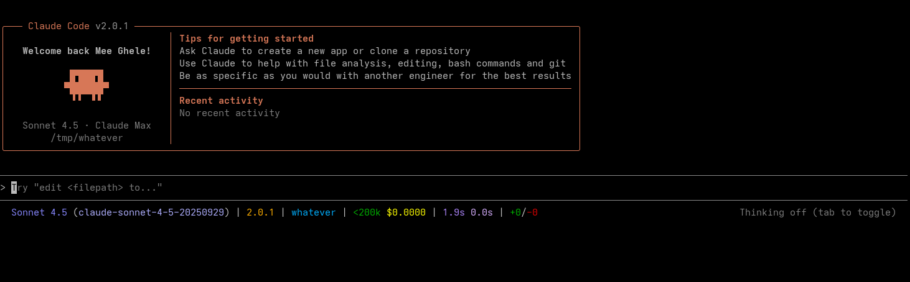
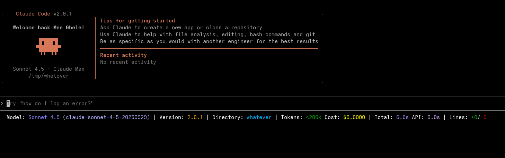

[](https://github.com/meeghele/mini-ccstatus/actions)
[](https://en.wikipedia.org/wiki/C_(programming_language))
[](#)
[](LICENSE)

# mini-ccstatus

A fast/minimal C implementation of the statusline for Claude Code CLI.

## Build & Test

### Prerequisites

Install build tools:

**Debian/Ubuntu:**
```bash
sudo apt-get install build-essential valgrind
```

**Fedora:**
```bash
sudo dnf install gcc make valgrind
```

### Building

GNU Make will build a binary into `./bin/mini-ccstatus`.`

```bash
# Builds the binary and prints the statusLine
make

# Prints the statusline
make demo

# Run the shell-based regression tests
make test

# Run memory checks
make valgrind

# Clean bin/ and obj/
make clean
```

Otherwise:

```bash
make all
```

## Usage

### Compact Mode
```json
{
  "statusLine": {
    "type": "command",
    "command": "~/mini-ccstatus/bin/mini-ccstatus",
    "padding": 0
  }
}
```

### Verbose Mode
```json
{
  "statusLine": {
    "type": "command",
    "command": "VERBOSE=yeah ~/mini-ccstatus/bin/mini-ccstatus",
    "padding": 0
  }
}
```

## Screenshots

### Compact Mode


### Verbose Mode


## Benchmarks

See [`benchmark/`](benchmark/) for performance comparison against other Claude Code statusline implementations, including:
- Anthropic's reference examples (Bash, Python, Node.js)
- Community implementations 

**Quick start:**

```bash
cd benchmark
./scripts/install.sh       # Install dependencies (hyperfine, jq, npm packages)
make time                  # Run time benchmarks
make memory                # Run memory benchmarks
make report                # Generate full benchmark report
```

For detailed documentation, see [`benchmark/README.md`](benchmark/README.md).

## Dependencies

This project includes [cJSON](https://github.com/DaveGamble/cJSON) (MIT License) vendored in `lib/cjson/`.

## License

Licensed under the MIT License. See `LICENSE` for details.

## Author

**Michele Tavella** – [meeghele@proton.me](mailto:meeghele@proton.me)
