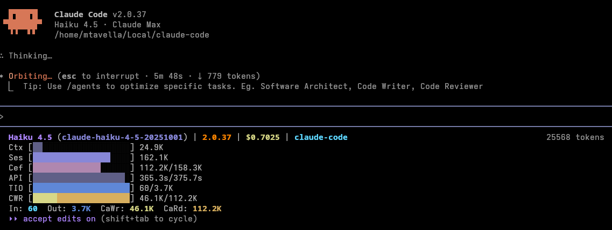

[](https://github.com/meeghele/mini-ccstatus/actions)
[](https://en.wikipedia.org/wiki/C_(programming_language))
[](#)
[](LICENSE)

# mini-ccstatus

A fast/minimal C implementation of the statusline for Claude Code CLI for Linux (tested on Debian/Ubuntu and Fedora). 




## Features

See [`images/`](images/) for an animated demo.

### Lightning Fast ⚡
- **< 5ms response time** - Instant status updates with zero lag
- **\~ 700x faster on average than other statuslines** - See [`benchmark/`](benchmark/) for more details
- **Single-pass parsing** - Processes transcripts without loading entire files into memory
- **Smart caching** - Session-aware cache with file-size change detection

### Rock Solid 🛡️
- **Zero crashes** - Rust-inspired error rail pattern prevents silent failures
- **Memory safe** - Overflow-checked arithmetic and bounds validation on all operations
- **Concurrent safe** - Advisory file locking prevents corruption in multi-process scenarios
- **No memory leaks** - RAII-like patterns ensure all resources are cleaned up

### Minimal Footprint 📦
- **Single binary** - No runtime dependencies, just copy and run
- **< 100KB executable** - Smaller than most shell scripts
- **Fixed memory usage** - No unbounded allocations or memory bloat
- **C11 standard** - Portable across all Linux distributions

### Smart Features 🧠
- **Context awareness** - Tracks both session and context window token usage
- **Visual progress bars** - Dual-color bars for input/output token/lines/API ratios
- **Cache efficiency metrics** - Monitor internal and API cache hit rates and performance
- **Compact visualization** - Progress bars appear only when real data is available

## Rationale

mini-ccstatus started while working on a project that runs multiple Claude Code instances in parallel for implementing unit, integration, and E2E tests across a complex, heavily algorithmic Go/TypeScript/Python codebase with ML/statistical components. These sessions stay alive for long stretches, so we want to monitor the internals with all the detail Anthropic currently exposes.

Other statusline implementations hammer the CPU, RAM, and batteries on our laptops, so - half as a joke - I wrote mini-ccstatus in C after benchmarking the alternatives; see [`benchmark/`](benchmark/) for the data.

## Installation

*Prerequisites*:

```bash
# Debian/Ubuntu
sudo apt-get install build-essential

# Fedora
sudo dnf install gcc make
```

*Build*:

```bash
git clone https://github.com/meeghele/mini-ccstatus.git
cd mini-ccstatus
make
```

## Demo

```bash
make demo-all
```

## Dependencies

- [**cJSON**](https://github.com/DaveGamble/cJSON) - Lightweight JSON parser (MIT License, vendored in `lib/cjson/`)
- **Standard C Library** - No other external dependencies

## Command Line Options

```bash
Usage: mini-ccstatus [OPTIONS]

Claude Code status line generator - reads JSON from stdin and outputs formatted status.

Options:
  -h, --help                      Show this help message and exit
  -d, --token-breakdown           Show detailed token breakdown
  -c, --context-tokens            Show context window percentage
  -t, --session-tokens            Show session total tokens
  -e, --cache-efficiency          Show cache efficiency ratio
  -p, --api-time-ratio            Show API time vs total time ratio
  -l, --lines-ratio               Show lines added vs removed ratio
  -i, --input-output-ratio        Show input vs output tokens ratio
  -w, --cache-write-read-ratio    Show cache write vs read tokens ratio
  -C, --clamping                  Clamp percentages to 100% max
  -a, --all                       Enable all token features
      --no-color                  Disable ANSI color output
  -v, --verbose                   Show field labels in status line
  -H, --hide-breakdown            Hide token breakdown line
  -s, --simple                    Show simplified status line (Model/Version/Directory only)

Environment Variables:
  NO_COLOR                 If set, disables ANSI color output

Examples:
  echo '{...}' | mini-ccstatus
  mini-ccstatus --all < status.json
  mini-ccstatus --verbose --context-tokens < status.json
```

## Display Modes

### Statusline and labels

mini-ccstatus supports several display modes:

- **Default**: Compact view
- **Simple** (`--simple` / `-s`): Model, version, and directory only
- **Verbose** (`--verbose` / `-v`): Compact with field labels
- **All Features** (`--all` / `-a`): All metrics including token breakdown

### Token Tracking

- **Total tokens** = inputTokens + outputTokens + cacheCreationTokens + cacheReadTokens
- **Context tokens** = tokens from last assistant message (input + cache creation + cache read)
- **Session tokens** = sum of all tokens across entire session

### Display Options

Individual display options can be combined to customize your statusline:

- **`-d, --token-breakdown`**: Shows detailed token breakdown by category (input, output, cache write, cache read) on a separate line
- **`-c, --context-tokens`**: Displays current context window usage as a percentage of the 200K token limit with a progress bar
- **`-t, --session-tokens`**: Shows cumulative token usage across the entire session as a percentage of the 200K limit
- **`-e, --cache-efficiency`**: Displays the ratio of the `mini-ccstatus` cache read tokens to total cache tokens (higher = better cache reuse)
- **`-p, --api-time-ratio`**: Shows percentage of session time spent waiting for API responses
- **`-l, --lines-ratio`**: Displays proportion of lines added vs removed with a dual-color progress bar
- **`-i, --input-output-ratio`**: Shows the proportion of input tokens vs output tokens with a dual-color progress bar
- **`-w, --cache-write-read-ratio`**: Displays proportion of cache write tokens vs cache read tokens
- **`-C, --clamping`**: Clamps percentage displays to 100% maximum (useful when usage exceeds context limits)
- **`-v, --verbose`**: Adds descriptive field labels to all metrics for better readability
- **`-H, --hide-breakdown`**: Suppresses the token breakdown line even when other token options are enabled

## Building & Testing

### Build Commands

```bash
make                       # Build binary and run demo
make all                   # Build, test, and run valgrind checks
make test                  # Run regression tests
make valgrind              # Run memory checks
make clean                 # Clean bin/ and obj/
```

### Debug Builds

```bash
make debug                 # Build with debug symbols
make demo-debug            # Build with debug logging and run demo
```

### Running Tests

```bash
make test                  # Run all regression tests
make valgrind              # Run memory leak detection
```

## Benchmarks

See [`benchmark/`](benchmark/) for performance comparison against other Claude Code statusline implementations, including:
- Anthropic's reference examples (Bash, Python, Node.js)
- Community implementations


### Configure Claude Code

Add to your `~/.claude/settings.json`:

```json
{
  "statusLine": {
    "type": "command",
    "command": "/path/to/mini-ccstatus/bin/mini-ccstatus --all",
    "padding": 0
  }
}
```

While the above `command` will display everything, the one below is a more sensible one I am currently using:

```json
{
  "statusLine": {
    "type": "command",
    "command": "/path/to/mini-ccstatus/bin/mini-ccstatus --simple --context-tokens --session-tokens --api-time-ratio --lines-ratio --input-output-ratio",
    "padding": 0
  }
}
```

## Contributing

Contributions are welcome! Please follow the semantic versioning branch naming convention:

- **main** - Production-ready code
- **develop** - Integration branch for features
- **feat/** - New features (`feat/advanced-caching`)
- **fix/** - Bug fixes (`fix/token-calculation`)
- **chore/** - Maintenance (`chore/update-dependencies`)

## License

Licensed under the MIT License. See [LICENSE](LICENSE) for details.

## Author

**Michele Tavella** - [meeghele@proton.me](mailto:meeghele@proton.me)
