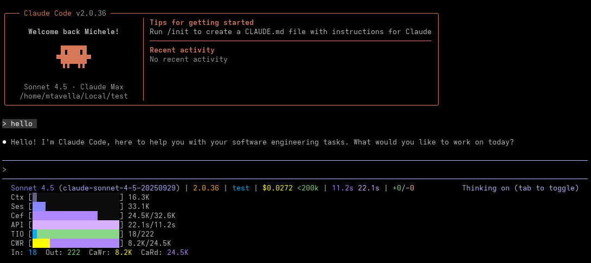
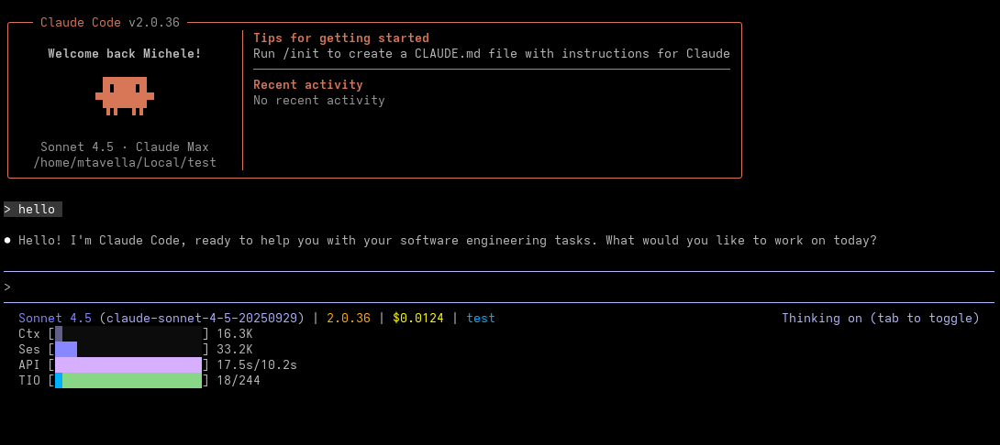
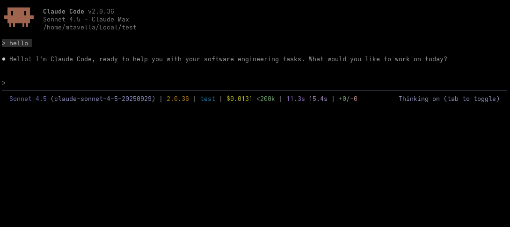

[](https://github.com/meeghele/mini-ccstatus/actions)
[](https://en.wikipedia.org/wiki/C_(programming_language))
[](#)
[](LICENSE)

# mini-ccstatus

A fast/minimal C implementation of the statusline for Claude Code CLI for Linux (tested on Debian/Ubuntu and Fedora).

## Quick Start

### Installation

*Prerequisites*:

```bash
# Debian/Ubuntu
sudo apt-get install build-essential

# Fedora
sudo dnf install gcc make
```

*Build*:

```bash
git clone https://github.com/meeghele/mini-ccstatus.git
cd mini-ccstatus
make
```

### Demo

```bash
make demo-all
```

## Command Line Options

```bash
Usage: mini-ccstatus [OPTIONS]

Claude Code status line generator - reads JSON from stdin and outputs formatted status.

Options:
  -h, --help                      Show this help message and exit
  -d, --token-breakdown           Show detailed token breakdown
  -c, --context-tokens            Show context window percentage
  -t, --session-tokens            Show session total tokens
  -e, --cache-efficiency          Show cache efficiency ratio
  -p, --api-time-ratio            Show API time vs total time ratio
  -l, --lines-ratio               Show lines added vs removed ratio
  -i, --input-output-ratio        Show input vs output tokens ratio
  -w, --cache-write-read-ratio    Show cache write vs read tokens ratio
  -C, --clamping                  Clamp percentages to 100% max
  -a, --all                       Enable all token features
      --no-color                  Disable ANSI color output
  -v, --verbose                   Show field labels in status line
  -H, --hide-breakdown            Hide token breakdown line
  -s, --simple                    Show simplified status line (Model/Version/Directory only)

Environment Variables:
  NO_COLOR                 If set, disables ANSI color output

Examples:
  echo '{...}' | mini-ccstatus
  mini-ccstatus --all < status.json
  mini-ccstatus --verbose --context-tokens < status.json
```

## Display Modes

mini-ccstatus supports several display modes:

- **Default**: Compact view
- **Simple** (`--simple` / `-s`): Model, version, and directory only
- **Verbose** (`--verbose` / `-v`): Compact with field labels
- **All Features** (`--all` / `-a`): All metrics including token breakdown

## Token Tracking

- **Total tokens** = inputTokens + outputTokens + cacheCreationTokens + cacheReadTokens
- **Context tokens** = tokens from last assistant message (input + cache creation + cache read)
- **Session tokens** = sum of all tokens across entire session

## Building & Testing

### Build Commands

```bash
make                       # Build binary and run demo
make all                   # Build, test, and run valgrind checks
make test                  # Run regression tests
make valgrind              # Run memory checks
make clean                 # Clean bin/ and obj/
```

### Debug Builds

```bash
make debug                 # Build with debug symbols
make demo-debug            # Build with debug logging and run demo
```

### Running Tests

```bash
make test                  # Run all regression tests
make valgrind              # Run memory leak detection
```

## Benchmarks

See [`benchmark/`](benchmark/) for performance comparison against other Claude Code statusline implementations, including:
- Anthropic's reference examples (Bash, Python, Node.js)
- Community implementations

### Dependencies

- [**cJSON**](https://github.com/DaveGamble/cJSON) - Lightweight JSON parser (MIT License, vendored in `lib/cjson/`)
- **Standard C Library** - No other external dependencies

### Configure Claude Code

Add to your `~/.claude/settings.json`:

```json
{
  "statusLine": {
    "type": "command",
    "command": "/path/to/mini-ccstatus/bin/mini-ccstatus",
    "padding": 0
  }
}
```

## Screenshots


### All



```json
{
  "statusLine": {
    "type": "command",
    "command": "/path/to/mini-ccstatus/bin/mini-ccstatus --all",
    "padding": 0
  }
}
```

### Custom



```json
{
  "statusLine": {
    "type": "command",
    "command": "/path/to/mini-ccstatus/bin/mini-ccstatus --simple --context-tokens --session-tokens --api-time-ratio --input-output-ratio",
    "padding": 0
  }
}
```

### Default



```json
{
  "statusLine": {
    "type": "command",
    "command": "/path/to/mini-ccstatus/bin/mini-ccstatus",
    "padding": 0
  }
}
```

### Demo

See [`images/`](images/) for an animated demo.

## Contributing

Contributions are welcome! Please follow the semantic versioning branch naming convention:

- **main** - Production-ready code
- **develop** - Integration branch for features
- **feat/** - New features (`feat/advanced-caching`)
- **fix/** - Bug fixes (`fix/token-calculation`)
- **chore/** - Maintenance (`chore/update-dependencies`)

## License

Licensed under the MIT License. See [LICENSE](LICENSE) for details.

## Author

**Michele Tavella** - [meeghele@proton.me](mailto:meeghele@proton.me)
