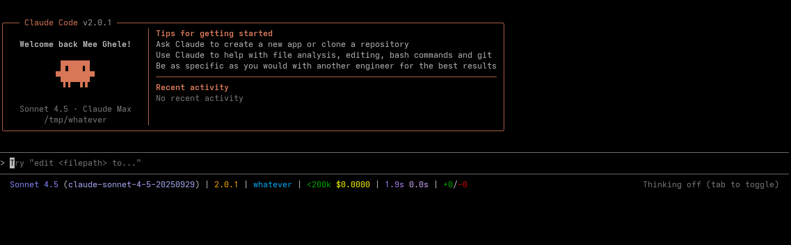
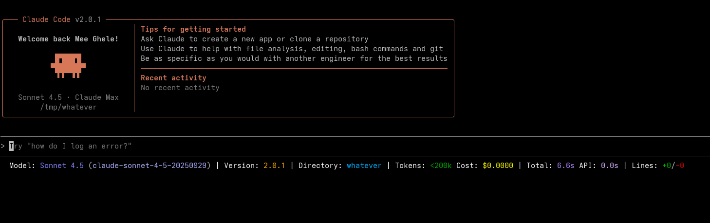

[](https://github.com/meeghele/mini-ccstatus/actions)
[](https://en.wikipedia.org/wiki/C_(programming_language))
[](#)
[](LICENSE)

# mini-ccstatus

A fast/minimal C implementation of the statusline for Claude Code CLI.

## Why?

Modern software development enables rapid implementation thanks to many levels of abstraction; often these levels of abstraction introduce overheads, and these overheads accumulate over time causing a drastic performance drop or abnormal resource consumption.

- The official Claude Code [Status line configuration](https://docs.claude.com/en/docs/claude-code/statusline#how-it-works) documentation mentions that the status line command is executed *at most every 300ms*.

- This means that running one instance of Claude Code CLI for 4h a day will run the status line command a total of `4h * 3600s/h * 1000 ms/s / 300ms = 48000 times`.

- `48k` daily runs account for `960k` monthly runs, which is very close to `1M`.  

Therefore:

- If we are running a command so many times, that command should be very efficient to avoid wasting CPU, RAM, and energy.

- This is why I wrote the C implementation: being minimal and lightweight, it comes with negligible overhead, executing in `~ 500 µs` and using `3MB` of RAM.

- Other implementations based on Node.js are more feature-rich, but for them to be executed the interpreter must run as well, consuming significant resources, which might be overkill for a status line.

For detailed performance comparisons, see the [benchmark results](benchmark/).

## Build & Test

### Prerequisites

Install build tools:

**Debian/Ubuntu:**
```bash
sudo apt-get install build-essential valgrind
```

**Fedora:**
```bash
sudo dnf install gcc make valgrind
```

### Building

GNU Make will build a binary into `./bin/mini-ccstatus`.

```bash
# Builds the binary and prints the statusLine
make

# Prints the statusline
make demo

# Run the shell-based regression tests
make test

# Run memory checks
make valgrind

# Clean bin/ and obj/
make clean
```

Otherwise:

```bash
make all
```

## Usage

### Compact Mode
```json
{
  "statusLine": {
    "type": "command",
    "command": "~/mini-ccstatus/bin/mini-ccstatus",
    "padding": 0
  }
}
```

### Verbose Mode
```json
{
  "statusLine": {
    "type": "command",
    "command": "VERBOSE=yeah ~/mini-ccstatus/bin/mini-ccstatus",
    "padding": 0
  }
}
```

## Screenshots

### Compact Mode


### Verbose Mode


## Dependencies

This project includes [cJSON](https://github.com/DaveGamble/cJSON) (MIT License) vendored in `lib/cjson/`.

## License

Licensed under the MIT License. See `LICENSE` for details.

## Author

**Michele Tavella** – [meeghele@proton.me](mailto:meeghele@proton.me)
